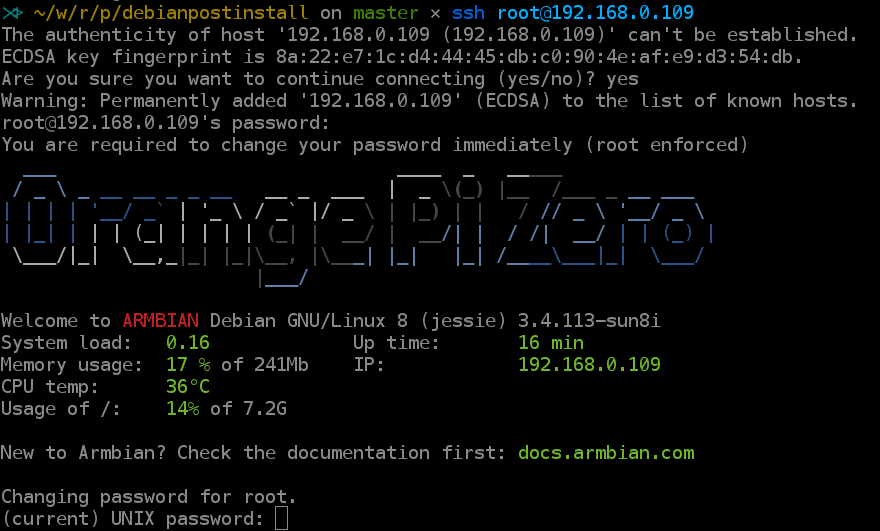
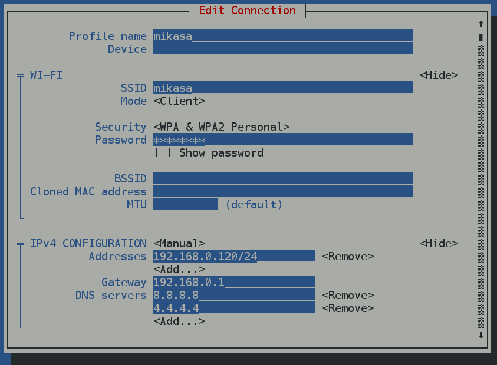
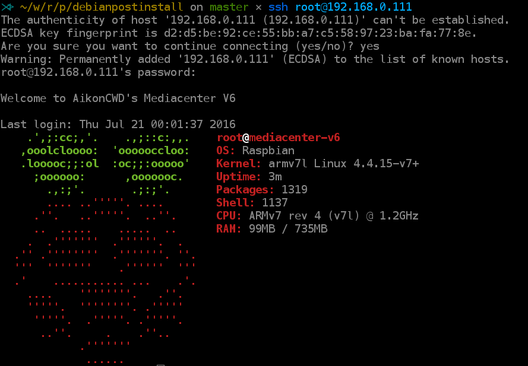

<table style="width:3%;">
<colgroup>
<col width="2%" />
</colgroup>
<tbody>
<tr class="odd">
<td>title: Debian Post-install subtitle: Un documento de BricoLabs author: - Sergio Alvariño <a href="mailto:salvari@gmail.com">salvari@gmail.com</a> tags: [Pandoc, Documentación, makefile, git] date: julio-2016 lang: es-ES abstract: | Instalación de Debian</td>
</tr>
<tr class="even">
<td>Algunas notas referentes a la instalación de Debian Jessie</td>
</tr>
</tbody>
</table>

Introducción
============

Mi portátil es un ordenador Acer 5755G con las siguientes características:

-   Core i5 2430M 2.4GHz

-   NVIDIA Geforce GT 540M

-   8Gb RAM

-   750Gb HD

Mi portátil equipa una tarjeta *Nvidia Geforce GT540M* que resulta pertenecer a una rama muerta en el árbol de desarrollo de Nvidia.

La gráfica es una Nvidia Optimus, es decir una tarjeta híbrida que funcionaba perfectamente en Ubuntu 14.04 usando Bumblebee.

Con el paso a Ubuntu *Xenial Xerus* mi tarjeta gráfica dejó de funcionar correctamente con el procedimiento de instalación de Bumblebee que venía usando. Y con todos los que fui capaz de probar.

A mayores me encontré también con problemas insalvables para instalar el Virtual Box así que decidí volver a Debian.

Para hacer la actualización del sistema opté por desinstalar el dvd y montar en su lugar un disco SSD en un Caddie para Acer. La instalación fué muy fácil, y aunque el portátil arranca perfectamente de cualquiera de los dos discos opté por instalar el SSD en la bahía del HD original y pasar el HD al caddie.

Una vez instalado el sistema operativo, lo primero fue la instalación del Bumblebee para probar que funcionaba normalmente.

    sudo apt-get install firmware-linux-nonfree Bumblebee-nvidia primus

Cambiar las opciones de idioma
==============================

Ejecutamos:

``` {bash}
sudo dpkg-reconfigure locales
```

Y después solo tenemos que cambiar la selección del idioma en la configuración de Gnome.

Nos pedirá rearrancar Gnome y renombrará todos los directorios de sistema.

Gestión de paquetes
===================

Instalamos *aptitude*, *synaptic* y *gdebi*

``` {bash}
sudo apt-get install aptitude
sudo apt-get install synaptic
sudo apt-get install gdebi
```

Cambiamos las opciones de *aptitude* para que **no instale** los paquetes recomendados.

Quitamos el cdrom de los sources.list
-------------------------------------

Editamos el fichero */etc/apt/sources.list* y comentamos las lineas del cdrom.

Habilitamos los backports y multimedia
--------------------------------------

### Backports:

``` {bash}
sudo cat > /etc/apt/sources.list.d/backports.list << EOF
# backports
deb http://ftp.debian.org/debian/ jessie-backports main contrib non-free
EOF
```

### Multimedia:

``` {bash}
sudo cat >> /etc/apt/sources.list.d/multimedia.list << EOF
# multimedia
deb http://www.deb-multimedia.org/ jessie main non-free
EOF

sudo apt-get -y --allow-unauthenticated install --reinstall deb-multimedia-keyring
```

Y actualizamos

``` {bash}
sudo aptitude update
```

Instalación de varios paquetes sueltos
======================================

Programas de utilidad y uso frecuente
-------------------------------------

### Menulibre

Un editor de menús para Gnome, nos permite generar los archivos desktop para cualquier aplicación. Mucho más completo que *alacarte* la otra alternativa.

    sudo apt-get install menulibre

### Terminator

Terminator es un emulador de terminal muy completo y muy flexible. Los instalamos desde *aptitude*

``` {bash}
sudo aptitude install terminator python-keybinder
```

### Keepass2

Instalado *keepass2* desde Debian

    sudo aptitude install keepass2

### gksu

Un *sudo* en modo gráfico:

    sudo aptitude install gksu

**Muy importante** ejecutar `gksu-properties` y escoger el modo `sudo` en lugar de `su`. Nos evitaremos problemas con la instalación de muchas aplicaciones.

### Diskmanager

Para gestionar discos portátiles

    sudo apt-get install ntfs-3g disk-manager

### Gnucash

Finanzas en linux, para mi imprescindible.

    sudo apt-get -t jessie-backports install gnucash

### Herramientas *sync*

La uso para hacer mis backups a discos externos.

    sudo apt-get install rsync grsync

### Dropbox

Bajado el paquete Debian desde la página [web de Dropbox](https://www.dropbox.com/install-linux), instalado el paquete con *packageinstall*, es decir, simplemente pinchando desde el gestor de ficheros.

### Compresores et al

``` {bash}
sudo apt-get install rar unrar zip unzip unace bzip2 lzop p7zip p7zip-full p7zip-rar
```

### Freeplane

Mejor que [Freemind](http://freemind.sourceforge.net/wiki/index.php/Main_Page) (en mi opinión). El baile de siempre, descargar de la [web](http://www.freeplane.org/), descomprimir en *~/apps* y crear lanzador con *MenuLibre*. Todos los ficheros que tenía de *Freemind* se pueden usar directamente con *Freeplane*.

### Telegram desktop

El cliente de mensajeria de Telegram. Descargado desde la web, instalado en *~/apps*

Internet
--------

### Chrome y Chromium

Instalado chrome añadiendo fuentes a aptitude. No recuerdo como las añadí, pero en el fichero */etc/apt/sources.list.d/google-chrome.list*, tengo los siguientes contenidos:

    ###
    ###
    ###
    ###
    ### THIS FILE IS AUTOMATICALLY CONFIGURED ###
    # You may comment out this entry, but any other modifications may be lost.
    deb [arch=amd64] http://dl.google.com/linux/chrome/deb/ stable main

Ejecutamos:

``` {bash}
sudo aptitude install google-chrome-stable
sudo aptitude install chromium
```

### Tor

El navegador anónimo.

Bajamos el zip de la aplicación desde la [web](https://www.torproject.org) y descomprimido en *~/apps* copiado el fichero desktop a *~/.local/share/applications*

### openvpn

Basado en la web [nix/bsd](https://nixbsd.wordpress.com/2017/04/01/freebsd-10-2-configure-openvpn-client/).

### Deluge

El cliente torrent que uso habitualmente. Instalamos desde aptitude

    sudo aptitude install deluge
    xdg-mime default deluge.desktop x-scheme-handler/magnet

### TiddlyDesktop

*Tiddly* es una wiki auto-contenida y muy flexible, tiene un sinfin de versiones adaptadas para diferentes usos. Hace años que la uso como cuaderno de bitácora personal, pero no había seguido su evolución.

Me he descargado:

-   [Tiddlywiki](http://tiddlywiki.com/) y le he instalado los plugins de *FontAwesome* y *WikiMap*, este será mi nuevo cuaderno de bitácora.
-   [GSD5](http://gsd5.tiddlyspot.com/) un *TiddlyWiki* adaptado a *GTD*

A mayores me he instalado la aplicación [TiddlyDesktop](https://github.com/Jermolene/TiddlyDesktop), basada en *node webkit* que simplifica el tema de backups (en teoría).

Como siempre la instalamos en *~/apps* y creamos un lanzador con *MenuLibre*.

Gráficos
--------

### Inkscape

El programa libre para creación y edición de gráficos vectoriales.

``` {bash}
apt-cache policy inkscape
apt-get -t jessie-backports install inkscape
aptitude install ink-generator
```

### LibreCAD y FreeCAD

Imprescindibles para el diseño de cacharros. Instalados desde repos con aptitude

    apt-get install librecad

    apt-get -t jessie-backports install freecad

### Gimp

El programa para edición y retocado de imágenes.

Gimp ya estaba instalado, adicionalmente instalado el gimp data-extra

    sudo aptitude install gimp-plugin-registry gimp-texturize gimp-data-extras gimp-gap

### Shutter

Un programa de captura de pantallas que permite editarlas rápida y fácilmente:

    sudo aptitude install shutter libgoo-canvas-perl

### Pencil

Una aplicación java para hacer esquemas de aplicaciones web, puede que no lo necesites.

Descargar la última versión (paquete Debian) desde [la página web](http://pencil.evolus.vn/). Lo instalamos y listo. Puede dar problemas si usamos Iceweasel, ya que el paquete depende de Firefox. Más info [aquí](https://www.linuxwebzone.com/install-pencil-on-debian/)

Fotografía
----------

### Rawtherapee y Darktable: Tratamiento de imágenes fotogŕaficas

Si te gusta la fotografía y/o tienes una cámara reflex, definitivamente necesitas estas aplicaciones.

    sudo aptitude install icc-profiles icc-profiles-free
    sudo aptitude install rawtherapee darktable

### Stopmotion

Para hacer pélis de animación Stopmotion.

    sudo aptitude install stopmotion vgrabbj dvgrab

TODO: Probar qStopmotion

Audio y video
-------------

### Codecs

Instalamos los codecs

``` {bash}
sudo apt-get install libav-tools

sudo apt-get install faad gstreamer0.10-ffmpeg gstreamer0.10-x \
gstreamer0.10-fluendo-mp3 gstreamer0.10-plugins-base \
gstreamer0.10-plugins-good gstreamer0.10-plugins-bad \
gstreamer0.10-plugins-ugly ffmpeg lame twolame vorbis-tools \
libquicktime2 libfaac0 libmp3lame0 libxine2-all-plugins libdvdread4 \
libdvdnav4 libmad0 sox libxvidcore4 libstdc++5

sudo apt-get install w64codecs
```

### Reproductores de música

Instalamos *Clementine*, *decibel*, *audacity*, *soundconverter*:

``` {bash}
sudo aptitude install clementine gstreamer0.10-plugins-bad
sudo aptitude install decibel-audio-player audacity soundconverter
```

### Gpodder

Instalamos *gpodder* para gestionar nuestros podcast, aunque *Clementine* también nos vale.

    sudo aptitude install gpodder

### Spotify

Cliente de *Spotify*

    sudo apt-key adv --keyserver hkp://keyserver.ubuntu.com:80 --recv-keys BBEBDCB318AD50EC6865090613B00F1FD2C19886
    echo deb http://repository.spotify.com stable non-free | sudo tee /etc/apt/sources.list.d/spotify.list
    sudo aptitude update
    sudo aptitude install spotify-client

### Video

Instalamos también utilidades de video:

``` {bash}
sudo aptitude install vlc browser-plugin-vlc
sudo aptitude install recordmydesktop gtk-recordmydesktop
sudo aptitude install vokoscreen
sudo aptitude install handbrake handbrake-cli handbrake-gtk
```

Seguridad
---------

### Lector de DNIe

Instalamos:

    sudo aptitude libccid install pcscd pcsc-tools

Como root ejecutamos *pcsc\_scan* [1]:

    root@rasalhague:~# pcsc_scan 
    PC/SC device scanner
    V 1.4.23 (c) 2001-2011, Ludovic Rousseau <ludovic.rousseau@free.fr>
    Compiled with PC/SC lite version: 1.8.11
    Using reader plug'n play mechanism
    Scanning present readers...
    Waiting for the first reader...

Si insertamos el lector veremos algo como esto:

    root@rasalhague:~# pcsc_scan 
    PC/SC device scanner
    V 1.4.23 (c) 2001-2011, Ludovic Rousseau <ludovic.rousseau@free.fr>
    Compiled with PC/SC lite version: 1.8.11
    Using reader plug'n play mechanism
    Scanning present readers...
    Waiting for the first reader...found one
    Scanning present readers...
    0: C3PO LTC31 v2 (11061005) 00 00

    Wed Jan 25 01:17:20 2017
    Reader 0: C3PO LTC31 v2 (11061005) 00 00
      Card state: Card removed, 

Si insertamos un DNI veremos que se lee la información de la tarjeta insertada:

    Reader 0: C3PO LTC31 v2 (11061005) 00 00
      Card state: Card inserted, 
    y mas rollo

Instalamos ahora:

    aptitude install pinentry-gtk2 opensc

Documentos
==========

Calibre
-------

La mejor utilidad para gestionar tu colección de libros electrónicos.

Ejecutamos lo que manda la página web:

    sudo -v && wget -nv -O- https://raw.githubusercontent.com/kovidgoyal/calibre/master/setup/linux-installer.py \
    | sudo python -c "import sys; main=lambda:sys.stderr.write('Download failed\n'); exec(sys.stdin.read()); main()"

Para usar el calibre con el Kobo Glo:

-   Desactivamos todos los plugin de Kobo menos el *Kobo Touch Extended*
-   Creamos una columna *MyShelves* con identificativo *\#myshelves*
-   En las opciones del plugin:

    -   En la opción *Collection columns* añadimos las columnas *series,\#myshelves*
    -   Marcamos las opciones *Create collections* y *Delete empy collections*
    -   *Update metadata on device* y *Set series information*

Algunos enlaces útiles:

-   <https://github.com/jgoguen/calibre-kobo-driver>
-   <http://www.lectoreselectronicos.com/foro/showthread.php?15116-Manual-de-instalaci%C3%B3n-y-uso-del-plugin-Kobo-Touch-Extended-para-Calibre>
-   <http://www.redelijkheid.com/blog/2013/7/25/kobo-glo-ebook-library-management-with-calibre>
-   <https://www.netogram.com/kobo.htm>

Pandoc
------

Pandoc es un traductor entre formatos de documento. Está escrito en Python y es increiblemente útil. De hecho este documento está escrito con *Pandoc*.

Instalado el Pandoc descargando paquete *deb* desde la página web del Pandoc.

Descargamos las plantillas desde [el repo](https://github.com/jgm/pandoc-templates) ejecutando los siguientes comandos:

``` {bash}
cd ~/.pandoc
git clone https://github.com/jgm/pandoc-templates templates
```

Zotero
------

Zotero es un programa que te permite guardar una o varias bibliografías con referencias a libros, páginas web o documentos electrónicos.

Instalado el Zotero Standalone desde la [página web del programa](https://www.zotero.org/)

Vanilla LaTeX
-------------

El LaTeX de Debian está un poquillo anticuado, si se quiere usar una versión reciente hay que aplicar [este truco](http://tex.stackexchange.com/questions/1092/how-to-install-vanilla-texlive-on-debian-or-ubuntu).

``` {bash}
cd ~
mkdir tmp
cd tmp
wget http://mirror.ctan.org/systems/texlive/tlnet/install-tl-unx.tar.gz
tar xzf install-tl-unx.tar.gz
cd install-tl-xxxxxx
```

La parte xxxxxx varía en función del estado de la última versión de LaTeX disponible.

``` {bash}
sudo ./install-tl
```

Una vez lanzada la instalación podemos desmarcar las opciones que instalan la documentación y las fuentes. Eso nos obligará a consultar la documentación *on line* pero ahorrará practicamente el 50% del espacio necesario. En mi caso sin *doc* ni *src* ocupa 2,3Gb

``` {bash}
mkdir -p /opt
sudo ln -s /usr/local/texlive/2016/bin/* /opt/texbin
```

Por último para acabar la instalación añadimos **/opt/texbin** al *path*.

### Falsificando paquetes

Ya tenemos el **texlive** instalado, ahora necesitamos que el gestor de paquetes sepa que ya lo tenemos instalado.

``` {bash}
sudo apt-get install equivs --no-install-recommends
mkdir -p /tmp/tl-equivs && cd /tmp/tl-equivs
equivs-control texlive-local
```

Para hacerlo más fácil podemos descargarnos un fichero ya preparado, ejecutando:

``` {bash}
wget http://www.tug.org/texlive/files/debian-equivs-2015-ex.txt
/bin/cp -f debian-equivs-2015-ex.txt texlive-local
```

Editamos la versión y

``` {bash}
equivs-build texlive-local
sudo dpkg -i texlive-local_2015-1_all.deb
```

Todo listo, ahora podemos instalar cualquier paquete que dependa de texlive

### Fuentes

Para dejar disponibles las fuentes opentype y truetype que vienen con texlive para el resto de aplicaciones:

``` {bash}
sudo cp $(kpsewhich -var-value TEXMFSYSVAR)/fonts/conf/texlive-fontconfig.conf /etc/fonts/conf.d/09-texlive.conf
gksudo gedit /etc/fonts/conf.d/09-texlive.conf
```

Borramos la linea:

``` {xml}
<dir>/usr/local/texlive/2016/texmf-dist/fonts/type1</dir>
```

Y ejecutamos:

``` {bash}
sudo fc-cache -fsv
```

### Actualizaciones

Para actualizar nuestro latex a la última versión de todos los paquetes:

``` {bash}
sudo /opt/texbin/tlmgr update --self
sudo /opt/texbin/tlmgr update --all
```

También podemos lanzar el instalador gráfico con:

``` {bash}
sudo /opt/texbin/tlmgr --gui
```

Para usar el instalador gráfico hay que instalar previamente:

``` {bash}
sudo apt-get install perl-tk --no-install-recommends
```

### Lanzador para el actualizador de texlive

``` {bash}
mkdir -p ~/.local/share/applications
/bin/rm ~/.local/share/applications/tlmgr.desktop
cat > ~/.local/share/applications/tlmgr.desktop << EOF
[Desktop Entry]
Version=1.0
Name=TeX Live Manager
Comment=Manage TeX Live packages
GenericName=Package Manager
Exec=gksu -d -S -D "TeX Live Manager" '/opt/texbin/tlmgr -gui'
Terminal=false
Type=Application
Icon=system-software-update
EOF
```

Ojo que hay que dejar instalado el gksu (aunque debería estar de antes si sigues este doc)

``` {bash}
sudo aptitude install gksu
```

Emacs
-----

Instalado emacs desde los repos:

``` {bash}
sudo aptitude install emacs
```

Instalamos los paquetes *markdown-mode*, *mardown-plus* y *pandoc-mode* desde el menú de gestión de paquetes de **emacs**.

También instalamos *d-mode* y *flymake-d*.

Después de probar *flymake* y *flycheck* al final me ha gustado más *flycheck* Hay una sección de configuración en el fichero *.emacs* para cada uno de ellos, pero la de *flymake* está comentada.

Configuramos el fichero *.emacs* definimos algunas preferencias, algunas funciones útiles y añadimos orígenes extra de paquetes.

``` {lisp}
(custom-set-variables
 ;; custom-set-variables was added by Custom.
 ;; If you edit it by hand, you could mess it up, so be careful.
 ;; Your init file should contain only one such instance.
 ;; If there is more than one, they won't work right.
 '(show-paren-mode t))
(custom-set-faces
 ;; custom-set-faces was added by Custom.
 ;; If you edit it by hand, you could mess it up, so be careful.
 ;; Your init file should contain only one such instance.
 ;; If there is more than one, they won't work right.
 )

;;------------------------------------------------------------
;; Some settings
(setq inhibit-startup-message t) ; Eliminate FSF startup msg
(setq frame-title-format "%b")   ; Put filename in titlebar
;(setq visible-bell t)            ; Flash instead of beep
(set-scroll-bar-mode 'right)     ; Scrollbar placement
(show-paren-mode t)              ; Blinking cursor shows matching parentheses
(setq column-number-mode t)  ; Show column number of current cursor location
(mouse-wheel-mode t)         ; wheel-mouse support

(setq fill-column 78)
(setq auto-fill-mode t)          ; Set line width to 78 columns...

(setq-default indent-tabs-mode nil)       ; Insert spaces instead of tabs
(global-set-key "\r" 'newline-and-indent) ; turn autoindenting on
;(set-default 'truncate-lines t)           ; Truncate lines for all buffers
;(require 'iso-transl)                     ; doesn't seems to be needed in debian


;;------------------------------------------------------------
;; Some useful key definitions
(define-key global-map [M-S-down-mouse-3] 'imenu)
(global-set-key [C-tab] 'hippie-expand)                    ; expand
(global-set-key [C-kp-subtract] 'undo)                     ; [Undo] 
(global-set-key [C-kp-multiply] 'goto-line)                ; goto line
(global-set-key [C-kp-add] 'toggle-truncate-lines)         ; goto line
(global-set-key [C-kp-divide] 'delete-trailing-whitespace) ; delete trailing whitespace
(global-set-key [C-kp-decimal] 'completion-at-point)       ; complete at point
(global-set-key [C-M-prior] 'next-buffer)                  ; next-buffer
(global-set-key [C-M-next] 'previous-buffer)               ; previous-buffer

;;------------------------------------------------------------
;; Set encoding
(prefer-coding-system 'utf-8)
(setq coding-system-for-read 'utf-8)
(setq coding-system-for-write 'utf-8)

;;------------------------------------------------------------
;; Maximum colors
(cond ((fboundp 'global-font-lock-mode)  ; Turn on font-lock (syntax highlighting)
       (global-font-lock-mode t)               ; in all modes that support it
       (setq font-lock-maximum-decoration t))) ; Maximum colors

;;------------------------------------------------------------
;; Use % to match various kinds of brackets...
;; See: http://www.lifl.fr/~hodique/uploads/Perso/patches.el

(global-set-key "%" 'match-paren)               ; % key match parents
(defun match-paren (arg)
  "Go to the matching paren if on a paren; otherwise insert %."
  (interactive "p")
  (let ((prev-char (char-to-string (preceding-char)))
        (next-char (char-to-string (following-char))))
    (cond ((string-match "[[{(<]" next-char) (forward-sexp 1))
          ((string-match "[\]})>]" prev-char) (backward-sexp 1))
          (t (self-insert-command (or arg 1))))))

;;------------------------------------------------------------
;; The wonderful bubble-buffer
(defvar LIMIT 1)
(defvar time 0)
(defvar mylist nil)

(defun time-now ()
   (car (cdr (current-time))))

(defun bubble-buffer ()
   (interactive)
   (if (or (> (- (time-now) time) LIMIT) (null mylist))
       (progn (setq mylist (copy-alist (buffer-list)))
          (delq (get-buffer " *Minibuf-0*") mylist)
          (delq (get-buffer " *Minibuf-1*") mylist)))
   (bury-buffer (car mylist))
   (setq mylist (cdr mylist))
   (setq newtop (car mylist))
   (switch-to-buffer (car mylist))
   (setq rest (cdr (copy-alist mylist)))
   (while rest
     (bury-buffer (car rest))
     (setq rest (cdr rest)))
   (setq time (time-now))) 

(global-set-key [f8] 'bubble-buffer)    ; win-tab switch the buffer

(defun geosoft-kill-buffer ()
   ;; Kill default buffer without the extra emacs questions
   (interactive)
   (kill-buffer (buffer-name))
   (set-name)) 
(global-set-key [C-delete] 'geosoft-kill-buffer) 

;;----------------------------------------------------------------------
;; MELPA and others
(when (>= emacs-major-version 24)
  (require 'package)
  (package-initialize)
  (add-to-list 'package-archives '("melpa" . "http://melpa.org/packages/") t)
  (add-to-list 'package-archives '("gnu" . "http://elpa.gnu.org/packages/") t)
  (add-to-list 'package-archives '("marmalade" . "https://marmalade-repo.org/packages/") t)
  )

; (add-to-list 'load-path "~/.emacs.d/")

;;----------------------------------------------------------------------
;; Packages installed via package
;;------------------------------

;;----------------------------------------------------------------------
;; flymake and flycheck installed from package
;; I think you have to choose only one

;; (require 'flymake)
;; ;;(global-set-key (kbd "C-c d") 'flymake-display-err-menu-for-current-line)
;; (global-set-key (kbd "C-c d") 'flymake-popup-current-error-menu)
;; (global-set-key (kbd "C-c n") 'flymake-goto-next-error)
;; (global-set-key (kbd "C-c p") 'flymake-goto-prev-error)

(add-hook 'after-init-hook #'global-flycheck-mode)
(global-set-key  (kbd "C-c C-p") 'flycheck-previous-error)
(global-set-key  (kbd "C-c C-n") 'flycheck-next-error)

;; Define d-mode addons
;; Activate flymake or flycheck for D
;; Activate auto-complete-mode
;; Activate yasnippet minor mode if available
;; Activate dcd-server
(require 'ac-dcd)
(add-hook 'd-mode-hook
          (lambda()
            ;;(flymake-d-load)
            (flycheck-dmd-dub-set-variables)
            (require 'flycheck-d-unittest)
            (setup-flycheck-d-unittest)
            (auto-complete-mode t)
            (when (featurep 'yasnippet)
              (yas-minor-mode-on))
            (ac-dcd-maybe-start-server)
            (ac-dcd-add-imports)
            (add-to-list 'ac-sources 'ac-source-dcd)
            (define-key d-mode-map (kbd "C-c ?") 'ac-dcd-show-ddoc-with-buffer)
            (define-key d-mode-map (kbd "C-c .") 'ac-dcd-goto-definition)
            (define-key d-mode-map (kbd "C-c ,") 'ac-dcd-goto-def-pop-marker)
            (define-key d-mode-map (kbd "C-c s") 'ac-dcd-search-symbol)
            (when (featurep 'popwin)
              (add-to-list 'popwin:special-display-config
                           `(,ac-dcd-error-buffer-name :noselect t))
              (add-to-list 'popwin:special-display-config
                           `(,ac-dcd-document-buffer-name :position right :width 80))
              (add-to-list 'popwin:special-display-config
                           `(,ac-dcd-search-symbol-buffer-name :position bottom :width 5)))))

;; Define diet template mode (this is not installed from package)
(add-to-list 'auto-mode-alist '("\\.dt$" . whitespace-mode))
(add-hook 'whitespace-mode-hook
          (lambda()
            (setq tab-width 2)
            (setq whitespace-line-column 250)
            (setq indent-tabs-mode nil)
            (setq indent-line-function 'insert-tab)))

;;----------------------------------------------------------------------
;; elpy
(elpy-enable)
```

Textadept
---------

Un potente editor de desarrollo, multiplataforma.

Viene incluido en el pack D-apt, por que es muy potente como IDE para **D**.

De momento lo único que he configurado es la fuente, para ello editamos el fichero *~/.textadept/init.lua* y añadimos la linea:

``` {lua}
ui.set_theme('light', {font = 'Meslo LG L Regular for Powerline', fontsize = 14})
```

Scribus
-------

Scribus es un programa libre de composición de documentos. con Scribus puedes elaborar desde los folletos de una exposición hasta una revista o un poster.

Instalado con aptitude

    sudo aptitude install scribus

Comix
-----

Mi lector de comics favorito.

Instalado con aptitude

    sudo aptitude install comix

Desarrollo sw
=============

Paquetes esenciales
-------------------

Estos son los paquetes esenciales para empezar a desarrollar software en Linux.

    sudo apt-get install build-essential checkinstall make automake cmake autoconf git git-core dpkg wget

Git
---

Control de versiones distribuido. Imprescindible.

Instalado git desde aptitude

``` {bash}
sudo aptitude install git
```

Configuración básica de **git**

``` {bash}
git config --global user.name "Nombre Apellido"
git config --global user.email "direccion@correo.com"
git config --global core.editor emacs
git config --global color.ui true
git config --global credential.helper cache
git config --global credential.helper 'cache --timeout=7200'
git config --global push.default simple
git config --global alias.sla 'log --oneline --decorate --graph --all'
git config --global alias.lg "log --graph --pretty=format:'%Cred%h%Creset -%C(yellow)%d%Creset %s %Cgreen(%cr) %Cblue<%an>%Creset' --abbrev-commit --date=relative --all"
git config --global alias.car 'commit --amend --no-edit'
git config --global alias.unstage reset
git config --global alias.st status
git config --global alias.last  'log -1 HEAD'
git config --global alias.ca 'commit -a'
```

Open Java
---------

    apt-get install openjdk-7-jre icedtea-7-plugin

Lenguaje de programación D (D programming language)
---------------------------------------------------

[El lenguaje de programación D](https://dlang.org/) es un lenguaje de programación de sistemas con una sintaxis similar a la de C y con tipado estático. Combina eficiencia, control y potencia de modelado con seguridad y productividad.

### D-apt e instalación de programas

Configurado [d-apt](http://d-apt.sourceforge.net/), instalados todos los programas incluidos

``` {bash}
sudo wget http://master.dl.sourceforge.net/project/d-apt/files/d-apt.list -O /etc/apt/sources.list.d/d-apt.list
sudo apt-get update && sudo apt-get -y --allow-unauthenticated install --reinstall d-apt-keyring && sudo apt-get update
```

Instalamos todos los programas asociados.

    sudo aptitude install dmd dub dcd dfix dfmt dscanner textadept

### DCD

Una vez instalado el DCD tenemos que configurarlo creando el fichero *~/.config/dcd/dcd.conf* con el siguiente contenido:

    /usr/include/dmd/druntime/import
    /usr/include/dmd/phobos

Podemos probarlo con:

    dcd-server &
    echo | dcd-client --search toImpl

### gdc

Instalado con

    sudo aptitude install gdc

### ldc

Instalado con:

    sudo aptitude install ldc

Para poder ejecutar aplicaciones basadas en [Vibed](http://vibed.org/), necesitamos instalar:

    sudo apt-get install -y libssl-dev libevent-dev

### Emacs para editar D

Instalados los siguientes paquetes desde *marmalade*

-   *d-mode*
-   *flymake-d*
-   *flycheck*
-   *flycheck-dmd-dub*
-   *flychek-d-unittest*
-   *auto-complete* (desde *melpa*)
-   *ac-dcd*

Se configura en el fichero **~/.emacs**:

``` {lisp}
;; (require 'flymake)
;; ;;(global-set-key (kbd "C-c d") 'flymake-display-err-menu-for-current-line)
;; (global-set-key (kbd "C-c d") 'flymake-popup-current-error-menu)
;; (global-set-key (kbd "C-c n") 'flymake-goto-next-error)
;; (global-set-key (kbd "C-c p") 'flymake-goto-prev-error)

(add-hook 'after-init-hook #'global-flycheck-mode)
(global-set-key  (kbd "C-c C-p") 'flycheck-previous-error)
(global-set-key  (kbd "C-c C-n") 'flycheck-next-error)

;; Define d-mode addons
;; Activate flymake or flycheck for D
;; Activate auto-complete-mode
;; Activate yasnippet minor mode if available
;; Activate dcd-server
(require 'ac-dcd)
(add-hook 'd-mode-hook
          (lambda()
            ;;(flymake-d-load)
            (flycheck-dmd-dub-set-variables)
            (require 'flycheck-d-unittest)
            (setup-flycheck-d-unittest)
            (auto-complete-mode t)
            (when (featurep 'yasnippet)
              (yas-minor-mode-on))
            (ac-dcd-maybe-start-server)
            (ac-dcd-add-imports)
            (add-to-list 'ac-sources 'ac-source-dcd)
            (define-key d-mode-map (kbd "C-c ?") 'ac-dcd-show-ddoc-with-buffer)
            (define-key d-mode-map (kbd "C-c .") 'ac-dcd-goto-definition)
            (define-key d-mode-map (kbd "C-c ,") 'ac-dcd-goto-def-pop-marker)
            (define-key d-mode-map (kbd "C-c s") 'ac-dcd-search-symbol)
            (when (featurep 'popwin)
              (add-to-list 'popwin:special-display-config
                           `(,ac-dcd-error-buffer-name :noselect t))
              (add-to-list 'popwin:special-display-config
                           `(,ac-dcd-document-buffer-name :position right :width 80))
              (add-to-list 'popwin:special-display-config
                           `(,ac-dcd-search-symbol-buffer-name :position bottom :width 5)))))

;; Define diet template mode (this is not installed from package)
(add-to-list 'auto-mode-alist '("\\.dt$" . whitespace-mode))
(add-hook 'whitespace-mode-hook
          (lambda()
            (setq tab-width 2)
            (setq whitespace-line-column 250)
            (setq indent-tabs-mode nil)
            (setq indent-line-function 'insert-tab)))
```

#### Referencias

-   <https://github.com/atilaneves/ac-dcd>
-   <https://github.com/Hackerpilot/DCD>

Processing
----------

Bajamos los paquetes de las respectivas páginas web, descomprimimimos en *~/apps/* y creamos los desktop file con **Menulibre**

Openframeworks
--------------

Bajamos el paquete comprimido de la página web del proyecto.

Descomprimimos en *~/apps*

Bajamos al directorio de la aplicación y ejecutamos:

    sudo  scripts/linux/debian/install_dependencies.sh
    sudo  scripts/linux/debian/install_codecs.sh

    cd scripts/linux
    ./compileOF.sh -j2

    cd OF/examples/graphics/polygonExample
    make
    make Run

    cd OF/scripts/linux
    ./compilePG.sh

Va a instalar un montón de dependencias, hay que tomarlo con calma.

Al final también va a añadir una linea al fichero *~/.profile*

    export PG_OF_PATH=/home/salvari/apps/of/of_v0.9.3_linux64_release

Python
------

De partida tenemos instalado dos versiones: *python* y *python3*

``` {bash}
python -V
Python 2.7.9

python3 -V
Python 3.4.2
```

### pip, virtualenv, virtualenvwrapper, virtualfish

*pip* es un gestor de paquetes para **Python** que facilita la instalación de librerías y utilidades.

Para poder usar los entornos virtuales instalaremos también *virtualenv*.

Instalamos los dos desde aptitude:

``` {bash}
sudo aptitude install python-pip python-virtualenv virtualenv

sudo pip install --upgrade pip
sudo pip install --upgrade virtualenv
```

*virtualenv* es una herramienta imprescindible en Python, pero da un poco de trabajo, así que se han desarrollado algunos frontends para simplificar su uso, para *bash* y *zsh* usaremos *virtualenvwrapper*, y para *fish* el *virtualfish*. Como veremos son todos muy parecidos.

Instalamos el virtualwrapper:

``` {bash}
sudo apt-get install virtualenvwrapper -y
```

Para usar *virtualenvwrapper* tenemos que hacer:

``` {bash}
source /usr/share/virtualenvwrapper/virtualenvwrapper.sh
```

O añadir esa linea a nuestros ficheros *.bashrc* y/o *.zshrc*

Yo he dejado la variable de entorno *WORKON\_HOME* sin definir, así que apunta al directorio por defecto, `~/.virtualenvs`. En ese directorio es donde se guardarán nuestros entornos virtuales.

[Aquí](http://virtualenvwrapper.readthedocs.io/en/latest/command_ref.html) tenemos la referencia de comandos de *virtualenvwrapper*

Por último, si queremos tener utilidades parecidas en nuestro *fish shell* instalamos *virtualfish*:

``` {bash}
sudo pip install virtualfish
```

[Aquí](http://virtualfish.readthedocs.io/en/latest/index.html) tenemos la documentación de *virtualfish* y la descripción de todos los comandos y plugins disponibles.

### iPython notebook

[iPython](https://ipython.org/), y su evolución [Jupyter](https://jupyter.org/index.html) proporcionan un entorno para interactivo de programación que permite elaborar documentos muy complejos con programas embebidos.

#### Instalar Jupyter en el Python del sistema

Seguimos las instrucciones [aquí](https://gist.github.com/frgomes/24c1923f2c9f14a27b14)

Si usamos el script descargado del github se instalará el **Jupyter** con el python3 del sistema. \_\_Conviene asegurarse de que estamos apuntando al python del S.O. y no a cualquier otro Python que hayamos instalado:

``` {bash}
which python
```

#### Instalar Anaconda Python

Teóricamente [Anaconda](https://www.continuum.io/downloads), es la forma fácil de poder usar *ipython notebook*. Así que la primera vez que instalé el iPython lo hice instalando *Anaconda* De hecho me he instalado dos versiones la que incluye el python2 y la que incluye el python3, aunque son completamente redundantes, basta con instalar una sola de ellas.

``` {bash}
bash Anaconda3-4.2.0-Linux-x86_64.sh
bash Anaconda2-4.2.0-Linux-x86_64.sh
```

Los he dejado instalados en *~/apps/anaconda2* y *~/apps/anaconda3*

Cada una de estas instalaciones incorpora su propia versión de Python. Para usarlas tenemos que cambiar nuestro PATH para que el Python deseado sea el primero que se selecciona.

Por ejemplo para activar anaconda3 en bash:

``` {bash}
export PATH="~/apps/anaconda3/bin:$PATH"
```

Para hacer lo mismo en fish:

``` {fish}
set -x PATH ~/apps/anaconda3/bin $PATH
```

#### iPython y GraphLab

La instalación de iPython y GraphLab (que es una librería comercial) la hice para realizar un curso.

Creamos un entorno conda con Python 2.7.x

    export PATH="~/apps/anaconda2/bin:$PATH"
    conda create -n gl-env python=2.7 anaconda

Activamos el nuevo entorno (todo esto lo hice en bash, en fish hay un problemilla con el entorno conda [mas info](https://penandpants.com/2014/02/28/using-conda-environments-and-the-fish-shell/))

    bash
    source activate gl-env

En el futuro esto es todo lo que tendremos que hacer activar el entorno conda donde estamos instalando el iPython.

Nos aseguramos de tener *pip* al dia:

    conda update pip

Instalamos la biblioteca [GraphLab Create](https://turi.com/products/create/). Esta biblioteca se supone que es fácil de usar pero está sujeta a licencia. [2]

Una vez registrado en la página web te pasan un número de registro que tienes que usar para instalar la biblioteca.

    pip install --upgrade --no-cache-dir https://get.graphlab.com/GraphLab-Create/2.1/your registered email address here/your product key here/GraphLab-Create-License.tar.gz

Y para terminar instalamos iPython [3]:

    conda install ipython-notebook

Desde ahora basta con activar el entorno que hemos creado para tener acceso al iPython.

    source activate gl-env

    ipython notebook

    source deactivate gl-env

##### Instalación alternativa con virtualenv

    # Create a virtual environment named e.g. gl-env
    virtualenv gl-env

    # Activate the virtual environment
    source gl-env/bin/activate

    # Make sure pip is up to date
    pip install --upgrade pip

    # Install IPython Notebook (optional)
    pip install "ipython[notebook]"

    # Install Jupyter Notebook (optional)
    pip install "jupyter"


    # Install your licensed copy of GraphLab Create
    pip install --upgrade --no-cache-dir https://get.graphlab.com/GraphLab-Create/2.1/your registered email address here/your product key here/GraphLab-Create-License.tar.gz

### Usar Emacs para editar Python

Instalamos *elpy* desde el gestor de paquetes de Emacs, concretamente desde el repo *marmalade*

Hay que habilitar *elpy* en el fichero **~/.emacs** para ello añadimos la linea

``` {lisp}
(elpy enable)
```

*flycheck* chequea el código python. Conviene instalar:

    sudo pip install pylint

#### TODO

Estudiar esto con calma <https://elpy.readthedocs.io/en/latest>

### Web2py

Desde [la página web oficial de web2py](http://www.web2py.com) descargamos el *source code* para usuarios normales.

Yo he descomprimido el framework en `~/apps/web2py`

Para que el framework soporte ssl convine generar los siguientes certificados:

    openssl genrsa -out server.key 2048
    openssl req -new -key server.key -out server.csr

    Country Name (2 letter code) [AU]:ES
    State or Province Name (full name) [Some-State]:CORUNA
    Locality Name (eg, city) []:CORUNA
    Organization Name (eg, company) [Internet Widgits Pty Ltd]:Mikasa
    Organizational Unit Name (eg, section) []:salvari
    Common Name (e.g. server FQDN or YOUR name) []:salvari
    Email Address []:salvari@gmail.com

    Please enter the following 'extra' attributes
    to be sent with your certificate request
    A challenge password []:secret1t05
    An optional company name []:Mikasa

Ahora ejecutamos:

    openssl x509 -req -days 365 -in server.csr -signkey server.key -out server.crt

Ahora deberíamos dejar los ficheros `server.key`, `server.csr` y `server.crt` en el directorio raiz de *web2py* y ya podremos arrancar el framework con los siguientes parámetros:

    python web2py.py -a 'admin_password' -c server.crt -k server.key -i 0.0.0.0 -p 8000

Y ya podemos acceder nuestro server en la dirección <https://localhost:8000>

Tampoco está de más instalar las librerías de graphviz:

    sudo aptitude install python-pygraphviz

### Selenium

Vamos a instalar *Selenium* para hacer TDD [4] de aplicaciones web con Python. Lo haremos siguiendo [estas instrucciones](http://selenium-python.readthedocs.io/index.html).

En principio lo voy a usar con el Python del sistema `Python 2.7.9` en este momento, y no lo voy a instalar en un *virtualenv*:

``` {bash}
sudo pip install -U selenium
```

Con esto nos queda instalado `Selenium 3.3.3`

Además de Selenium necesitamos los drivers de los navegadores que queremos controlar, de momento solo usaré *Firefox*, así que nos bajamos la última versión de Geckodriver (0.15.0). Simplemente nos bajamos el archivo, descomprimimos y dejamos el fichero en */usr/local/bin* con los permisos necesarios.

``` {bash}
sudo chown root:staff ~/tmp/geckodriver
sudo chmod 755 ~/tmp/geckodriver
sudo mv ~/tmp/geckodriver /usr/local/bin
```

Para probarlo escribimos un pequeño programa en Python:

``` {python}
from selenium import webdriver

browser = webdriver.Firefox()
browser.get('http://seleniumhq.org/')
```

------------------------------------------------------------------------

> **Nota**: Tengo que pensar bien como hacerlo.

Go language
-----------

Nos bajamos los binarios desde la [página oficial](https://golang.org/dl/)

Descomprimimos en */opt*, ejecutando (como root):

    cd /opt
    tar xvzf ~/Downloads/go1.8.linux-amd64.tar.gz 

Deberíamos dejar configuradas las siguientes variables de entorno:

    # Point to the local installation of golang.
    export GOROOT=/opt/go

    # Point to the location beneath which source and binaries are installed.
    export GOPATH=$HOME/go

    # Ensure that the binary-release is on your PATH.
    export PATH=${PATH}:${GOROOT}/bin

    # Ensure that compiled binaries are also on your PATH.
    export PATH=${PATH}:${GOPATH}/bin

Desarrollo hardware
===================

Arduino IDE
-----------

Bajamos los paquetes de la página [web](https://www.arduino.cc), descomprimimimos en *~/apps/arduino*.

Creamos un link al directorio del software que hemos descargado:

    cd ~/apps/arduino
    ln -s arduino-x.y.z current

La primera ves que instalamos será necesario crear el desktop file con **Menulibre** con las actulizaciones no será necesario, siempre y cuando apunte a *~/apps/arduino/current*

### Añadir biblioteca de soporte para Makeblock

Clonamos el [repo oficial en github](https://github.com/Makeblock-official/Makeblock-Libraries).

Una vez que descarguemos las librerias es necesario copiar el directorio `Makeblock-Libraries/makeblock` en nuestro directorio de bibliotecas de Arduino. En mi caso `~/Arduino/libraries/`.

Una vez instaladas las bibliotecas es necesario reiniciar el IDE Arduino si estaba arrancado. Podemos ver si se ha instalado correctamente simplemente echando un ojo al menú de ejemplos en el IDE, tendríamos que ver los ejemplos de *Makeblock*.

Un detalle importante para programar el Auriga-Me es necesario seleccionar el micro Arduino Mega 2560 en el IDE Arduino.

Pinguino IDE
------------

Tenemos el paquete de instalación disponible en su página [web](http://pinguino.cc/download.php)

Ejecutamos el programa de instalación. El programa descargará los paquetes Debian necesarios para dejar el IDE y los compiladores instalados.

Al acabar la instalación he tenido que crear el directorio *~/Pinguino/v11*, parece que hay algún problema con el programa de instalación y no lo crea automáticamente.

El programa queda correctamente instalado en */opt* y arranca correctamente, habrá que probarlo con los micros.

KiCAD
-----

Instalamos desde *backports*:

``` {bash}
sudo aptitude install -t jessie-backports kicad
```

Vamos a instalar a mayores algunas librerias de KiCAD, para poder crear Shields de Arduino.

-   [Freetronics](https://github.com/freetronics/freetronics_kicad_library) una libreria que no solo incluye Shield para Arduino sino una completa colección de componentes que nos permitirá hacer proyectos completos. [Freetronics](http://www.freetronics.com) es una especie de BricoGeek australiano, publica tutoriales, vende componentes, y al parecer mantiene una biblioteca para KiCAD. La biblioteca de Freetronics se mantiene en un repo de github. Lo suyo es incorporarla a cada proyecto, por que si la actualizas se pueden romper los proyectos que estes haciendo.
-   [eklablog](http://meta-blog.eklablog.com/kicad-librairie-arduino-pretty-p930786) Esta biblioteca de componentes está incluida en el github de KiCAD, así que teoricamente no habría que instalarla en nuestro disco duro.

Analizador lógico
-----------------

Mi analizador es un OpenBench de Seedstudio, [aquí hay mas info](http://dangerousprototypes.com/docs/Open_Bench_Logic_Sniffer)

### Sigrok

Instalamos **Sigrok**, simplemente desde los repos de Debian:

``` {bash}
sudo aptitude install sigrok
```

Al instalar **Sigrok** instalamos también **Pulseview**.

Si al conectar el analizador, echamos un ojo al fichero *syslog* vemos que al conectarlo se mapea en un puerto tty.

Si arrancamos **Pulseview** (nuestro usuario tiene que estar incluido en el grupo *dialout*), en la opción *File::Connect to device*, escogemos la opción *Openbench* y le pasamos el puerto. Al pulsar la opción *Scan for devices* reconoce el analizador correctamente como un *Sump Logic Analyzer*.

### Sump logic analyzer

Este es el software recomendado para usar con el analizador.

Descargamos el paquete de la [página del proyecto](https://www.sump.org) y descomprimimos en *~/apps*

Instalamos las dependencias:

``` {bash}
sudo aptitude install librxtx-java
```

Editamos el fichero *~/apps/Logic Analyzer/client/run.sh* y lo dejamos así:

    #!/bin/bash

    # java -jar analyzer.jar $*
    java -cp /usr/share/java/RXTXcomm.jar:analyzer.jar org.sump.analyzer.Loader

Y ya funciona.

### OLS

[Página oficial](https://www.lxtreme.nl/ols/)

Virtualización
==============

Docker
------

``` {bash}
apt-get install apt-transport-https ca-certificates
apt-key adv --keyserver hkp://p80.pool.sks-keyservers.net:80 --recv-keys 58118E89F3A912897C070ADBF76221572C52609D
edit docker.list with
deb https://apt.dockerproject.org/repo debian-jessie main

apt-cache policy docker-engine   -- comprobamos que todo está bien.


sudo apt-get install docker-engine   -- da un error en makedev por udev activo


sudo service docker start

sudo docker run hello-world   - todo bien

sudo gpasswd -a salvari docker
```

Virtualbox
----------

Tenemos que:

-   Añadir el fichero *virtualbox.list* al directorio */etc/apt/sources.list.d*
-   Bajarnos y añadir a nuestro llavero las claves públicas de Oracle
-   Actualizar la lista de paquetes
-   Instalar virtualbox
-   Añadir nuestro usuario al grupo vboxuser (no tengo claro que esto sea necesario)

    echo "deb http://download.virtualbox.org/virtualbox/debian jessie contrib" |sudo tee /etc/apt/sources.list.d/virtualbox.list wget -q https://www.virtualbox.org/download/oracle\_vbox\_2016.asc -O- | sudo apt-key add - sudo apt-get update sudo apt-get install virtualbox-5.1 sudo gpasswd -a salvari vboxusers

Una vez instalado el virtualbox tenemos que instalarnos el pack de extensiones, es muy importante descargar el pack correspondiente a nuestra versión desde [la página web de descargas](https://www.virtualbox.org/wiki/Downloads?)

Sin más que hacer doble click en el fichero descargado lo instalaremos en nuestra instancia de *Virtualbox* (necesitamos la contraseña de administración).

Virtualizando un Windows 7
--------------------------

-   2 Gb de ram
-   Create virtual hard disk
-   10Gb dinamically allocated
-   Settings -&gt; System-&gt;Boot Order: Quitamos el floppy
-   Storage -&gt; Add IDE Controller-&gt;Add Optical Disk -&gt; Choose Disk -&gt; ISO Image
-   Instalamos Windows en Inglés y con teclado en español

Una vez instalado el SO Windows instalamos las Guest Additions.

Shells alternativos: zsh y fish
===============================

Los dos son muy interesantes. He usado zsh casi un año, ahora voy a probar **fish**.

fish
----

Instalamos **fish** desde aptitude con:

``` {bash}
sudo aptitude install fish
```

Instalamos oh-my-fish

``` {bash}
curl -L https://github.com/oh-my-fish/oh-my-fish/raw/master/bin/install > install
fish install
rm install
```

Si queremos que **fish** sea nuestro nuevo *shell*:

    chsh -s `which fish`

zsh
---

Igualmente instalamos **zsh**:

``` {bash}
sudo aptitude install zsh
```

Vamos a usar antigen así que nos lo clonamos en \_~/apps/

``` {bash}
cd ~/apps
git clone https://github.com/zsh-users/antigen
```

Y editamos el fichero *~/.zshrc* para que contenga:

    source ~/apps/antigen/antigen.zsh

    # Load the oh-my-zsh's library.
    antigen use oh-my-zsh

    # Bundles from the default repo (robbyrussell's oh-my-zsh).
    antigen bundle git
    antigen bundle command-not-found
    antigen bundle autojump
    antigen bundle extract
    # antigen bundle heroku
    # antigen bundle pip
    # antigen bundle lein


    # Syntax highlighting bundle.
    antigen bundle zsh-users/zsh-syntax-highlighting

    # git
    antigen bundle arialdomartini/oh-my-git
    antigen theme arialdomartini/oh-my-git-themes oppa-lana-style

    # autosuggestions
    antigen bundle tarruda/zsh-autosuggestions

    #antigen theme agnoster

    # Tell antigen that you're done.
    antigen apply

    # append to path
    path+=('/home/salvari/apps/julia/current/bin/')
    # prepend
    # path=('/home/salvari/bin/' $path)
    # export PATH

Antigen ya se encarga de descargar todo lo que queramos utilizar en zsh.

Nos queda arreglar las fuentes para que funcione correctamente la linea de estado en los repos de git. Necesitamos una fuente *Awesome*

Instalación de fuentes adicionales
----------------------------------

Nos bajamos unas cuantas fuentes que soporten los iconos *Awesome*.

``` {bash}
cd ~/tmp
git clone https://github.com/abertsch/Menlo-for-Powerline
git clone https://github.com/powerline/fonts

mkdir ~/.fonts
cp someFontFile ~/.fonts/
fc-cache -vf ~/.fonts/
```

Reprap
======

Sl1c3r
------

Descargamos el paquete binario desde la página web.

-   Cambiar permisos en directorio */lib/vrt/*
-   Instalado *lib-canberra-module* desde aptitude
-   Es necesario instalar *freeglut*

OpenScad
--------

Instalado desde aptitude.

Printrun
--------

Descargamos desde github

Cura
----

Descargamos desde la pagina web

    sudo aptitude install python3-pyqt5
    sudo dpkg -i Cura-2.1.3-Linux.deb

``` {bash}
sudo apt-get install python-serial python-wxgtk2.8 python-pyglet python-numpy \
cython python-libxml2 python-gobject python-dbus python-psutil python-cairosvg git

python setup.py build_ext --inplace
```

Aplicaciones Web
================

Servidor Web
------------

### Apache

Instalamos el paquete *apache2*

    sudo aptitude install apache2

Si abrimos el navegador y visitamos <http://localhost/> veremos la página de Apache.

El directorio raiz por defecto de Apache en Debian es */var/www*, y el fichero de configuración principal es */etc/apache2/apache2.conf*. Hay ficheros de configuración adicionales en el directorio */etc/apache2* y sus subdirectorios. Por ejemplo:

-   /etc/apache2/mods-enabled
-   /etc/apache2/sites-enabled
-   /etc/apache2/conf-enabled

Además del Apache vamos a dejar instalado el *php5*

    sudo aptitude install php5 libapache2-mod-php5

Hay que reiniciar el servicio: `sudo service apache2 restart`

Si creamos un fichero */var/www/html/info.php*, que contenga las lineas:

    <?php
    phpinfo();
    ?>

Podemos ver en el siguiente enlace <http://localhost/info.php> si el php funciona correctamente.

Módulos de php relacionados con mysql:

    sudo aptitude install php5-mysqlnd php5-curl php5-gd php5-intl php-pear \
    php5-imagick php5-imap php5-mcrypt php5-memcache php5-pspell php5-recode \
    php5-snmp php5-sqlite php5-tidy php5-xmlrpc php5-xsl

### nginx

TODO

Servidores de bases de datos
----------------------------

### MySQL

Instalamos desde aptitude *mysql-server.5.6*

Opcionalmente (y muy recomendable)

    mysql_secure_instalallation

#### Actualización

Cambiamos el fichero *mysql.conf.d/mysqld.cnf*

    # max_allowed_packet      = 16M
    max_allowed_packet  = 500M

Reiniciamos el servicio:

    /etc/init.d/mysql restart

### Cliente SQL SQuirreL SQL

Descargamos el paquete desde la página [web](http://squirrel-sql.sourceforge.net/) y lo descomprimimos en *~/apps*, también tendremos que descargar el conector de mysql para java, por ejemplo desde [aquí](http://dev.mysql.com/downloads/connector/j/3.0.html)

Una vez instalado, creamos el desktop-file con *MenuLibre* y configuramos el driver *MySQL* añadiendo el path a donde hayamos dejado el conector java.

### MariaDB

**PENDIENTE**

Recetas varias
==============

Orange Pi Zero
--------------

Para usar la Orange Pi Zero tendremos que crear imágenes arrancables en tarjetas micro SD.

### Crear una SD arrancable

Dependiendo de donde conectemos la tarjeta tendremos que usar diferentes rutas. En el procedimiento descrito a continuación `${card}` será la ruta al dispositivo de la tarjeta y ${p} la partición (si la hay).

Si la tarjeta se conecta via adaptador USB, linux la va a asociar a un dispositivo /dev/sdx, por ejemplo en mi portátil el disco duro es `/dev/sda` las distintas particiones serán `/dev/sda1`, `/devb/sda2`, etc.

Si conectamos una memoria con un adaptador USB linux la podría mapear en `/dev/sdb` por ejemplo.

Si la memoria se conecta mediante una ranura SD, linux la asociará a un dispositivo `/dev/mmcblk0` o `/dev/mmcblk1`, etc. etc. Dependerá de la ranura usada. Las particiones en este tipo de dispositivos tienen rutas como por ejemplo `/dev/mmcblk0p1`.

Los datos se pueden almacenar directamente en la memoria SD o en una partición creada en la memoria.

Resumiendo:

-   `${card}` será `/dev/sdb` o `/dev/mmcblk0`
-   *c**a**r**d*{p} será `/dev/sdb1` o `/dev/mmcblk0p1`

Antes de seguir adelante hay que estar completamente seguro del dispositivo asociado a nuestra memoria SD para no armar ningún estropicio.

Hay varias comprobaciones que se pueden hacer:

`dmesg |tail` nos permitirá echar un ojo a los últimos mensajes en el log del sistema. Si acabamos de insertar la memoria veremos el dispositivo usado.

`sudo fdisk -l` nos permite ver las particiones montadas en nuestro linux, por ejemplo con mi SD en la ranura SD de mi portatil la salida es (entre otras cosas, he obviado las particiones de los discos duros):

``` {bash}
Disk /dev/mmcblk0: 7.4 GiB, 7948206080 bytes, 15523840 sectors
Units: sectors of 1 * 512 = 512 bytes
Sector size (logical/physical): 512 bytes / 512 bytes
I/O size (minimum/optimal): 512 bytes / 512 bytes
Disklabel type: dos
Disk identifier: 0x00000000
```

`cat /proc/partitions` también nos dará una lista de particiones, en mi portátil las que interesan son:

     179        0    7761920 mmcblk0
     179        1    7757824 mmcblk0p1

Descargamos la imagen de Jessie adaptada a la *Orange Pi Zero* desde la página <https://www.armbian.com/download/>

Descomprimimos la imagen y la grabamos en la tarjeta SD con el comando:

    sudo dd if=./Armbian_5.24_Orangepizero_Debian_jessie_3.4.113.img of=/dev/mmcblk0

Insertamos la tarjeta en la *Orange Pi* y le damos alimentación. El primer arranque llevará alrededor de tres minutos, y tras ese tiempo aun hará falta un minuto más para poder hacer login. Este retardo es debido a que el sistema intentará actualizar la lista de paquetes y creará un area de swap de emergencia en la SD, y además cambiará el tamaño de la partición que hemos creado para ocupar todo el espacio libre en la SD.

De momento solo la he arrancado y efectivamente las particiones han cambiado tras el arranque así que tiene buena pinta.

Volvemos a insertar la SD en la *Orange Pi* y la conectamos con un cable ethernet al router de casa. El Armbian viene configurado por defecto para obtener su IP desde un servidor DHCP.

Como mi cutre-router no me da información de las IP asignadas usamos *nmap*:

    nmap -sP 192.168.0.0 /24

Con eso averiguamos la IP asignada a la *Orange Pi Zero* y ya podemos hacer login con:

    ssh root@192.168.0.109

¡Y ya estamos!



Lo primero es poner al dia el sistema:

    apt-get update
    apt-get upgrade

Si quieres puedes reconfigurar el *time zone*:

    dpgk-reconfigura tzdata

### Conexión WIFI

Vamos a comprobar que todo va bien:

    root@orangepizero:~# iwconfig
    lo        no wireless extensions.

    tunl0     no wireless extensions.

    wlan0     IEEE 802.11bgn  ESSID:off/any
              Mode:Managed  Access Point: Not-Associated   Tx-Power=20 dBm
              Retry  long limit:7   RTS thr:off   Fragment thr:off
              Encryption key:off
              Power Management:on

    eth0      no wireless extensions.

Todo tiene buena pinta, vamos a ver si detecta WIFIs:

    root@orangepizero:~# iwlist wlan0  scan |grep ESSID
                        ESSID:"wificlientesR"
                        ESSID:"casa_de_verano"
                        ESSID:"MOVISTAR_BEEF"
                        ESSID:"wificlientesR"
                        ESSID:"R-wlan90"
                        ESSID:"MOVISTAR_BAAF"
                        ESSID:"ababab"
                        ESSID:"WLAN 77"
                        ESSID:"castillo"
                        ESSID:"unaWifi"
                        ESSID:""
                        ESSID:"mikasa"

Para configurar el wifi echamos un ojo al fichero `/etc/network/interfaces` pero en ese mismo fichero encontramos el aviso:

    # Armbian ships with network-manager installed by default. To save you time
    # and hassles consider using 'sudo nmtui' instead of configuring Wi-Fi settings
    # manually.

Así que basta con ejecutar `sudo nwtui` y ya podemos dar de alta nuestra wifi (yo la prefiero con IP estática).



Ejecutamos `ifconfig` y ya vemos nuestro nuevo interface configurado:

    ifconfig

    wlan0     Link encap:Ethernet  HWaddr a4:7c:f2:9a:97:7c
              inet addr:192.168.0.120  Bcast:192.168.0.255  Mask:255.255.255.0
              inet6 addr: fe80::a67c:f2ff:fe9a:977c/64 Scope:Link
              UP BROADCAST RUNNING MULTICAST  MTU:1500  Metric:1
              RX packets:2 errors:0 dropped:0 overruns:0 frame:0
              TX packets:8 errors:0 dropped:0 overruns:0 carrier:0
              collisions:0 txqueuelen:1000
              RX bytes:328 (328.0 B)  TX bytes:852 (852.0 B)

### Referencias

-   [Página oficial](http://www.orangepi.org/)
-   [Recursos oficiales](http://www.orangepi.org/downloadresources/) aquí hay imágenes y los esquemáticos
-   [Tienda en Aliexpress](https://www.aliexpress.com/store/1553371?spm=2114.8147860.0.0.F1q43C)
-   <http://linux-sunxi.org/Bootable_SD_card>
-   <https://www.armbian.com/orange-pi-zero/>
-   <https://docs.armbian.com/User-Guide_Getting-Started/>
-   <https://docs.armbian.com/Hardware_Allwinner/>
-   [GPIO](https://linux-sunxi.org/GPIO) Una explicación de como acceder al gpio desde terminal
-   [Info variada](https://linux-sunxi.org/Orange_Pi_Zero) Aquí tenemos el esquema de pines

Raspberry Pi Media Center
-------------------------

Bajamos la imagen con nuestro cliente torrent favorito desde [aquí](https://github.com/aikoncwd/aikoncwd-rpi-mediacenter), no os molesteis en clonar el directorio, hay que bajarse la imagen.

    sudo dd if=./Mediacenter-AikonCWD-v6.img  of=/dev/mmcblk0 bs=4M

Arrancamos con la toma ethernet conectada al router y nos conectamos tras averigurar la IP con `nmap` (ver *Orange Pi Zero*)



Una vez instalado los pasos recomendados:

1.  Cambiar la password de root: `passwd`
2.  Fijar una IP estática: Editamos el fichero `/etc/dhcpcd.conf`, ya de paso configuramos la IP estática para la WIFI

        interface eth0
        static ip_address=192.168.0.125/24
        static routers=192.168.0.1
        static domain_name_servers=8.8.8.8

        interface wlan0
        static ip_address=192.168.0.126/24
        static routers=192.168.0.1
        static domain_name_servers=8.8.8.8

    Una vez cambiado el fichero hay que reiniciar con `shutdown -r now`

3.  Configurar la WIFI, en esta parte damos por supuesto que tenemos la wifi con WPA activado.

    Echamos un ojo a nuestro interfaz radio con `iwconfig`, si aparece el `wlan0` todo va bien.

        wlan0     IEEE 802.11bgn  ESSID:off/any
                  Mode:Managed  Access Point: Not-Associated   Tx-Power=31 dBm
                  Retry short limit:7   RTS thr:off   Fragment thr:off
                  Encryption key:off
                  Power Management:on

    Tenemos que editar el fichero `/etc/network/interfaces` y asegurarnos de tener el `wlan0` como sigue:

        allow-hotplug wlan0
        iface wlan0 inet manual
            wpa-conf /etc/wpa_supplicant/wpa_supplicant.conf

    Ahora vamos a editar el fichero de configuración de `wpa_supplicant`, es decir `/etc/wpa_supplicant/wpa_supplicant.conf` y añadir un bloque `network` que sea como el que va a continuación, de paso he cambiado el `country` a "ES", asi que queda así:

        country=ES
        ctrl_interface=DIR=/var/run/wpa_supplicant GROUP=netdev
        update_config=1
        network={
          ssid="YOURSSID"
          psk="YOURPASSWORD"
        }

    Un reinicio y listos: `shutdown -r now`

Grabar time-lapse del escritorio
--------------------------------

### Usando avconv

Capturas periódicas de la pantalla:

``` {bash}
avconv -video_size 1366x768 -framerate 1/10 -f x11grab -i :0.0+0,0 -pix_fmt rgb24 ~/tmp/frames/frame_%05d.png
```

El framerate son imágenes por segundo, así que aquí estamos diciendo que capturamos una imagen cada 10 sg.

TODO
====

-   cinelerra
-   playonlinux
-   krita
-   mypaint
-   qStopmotion
-   chibios
    -   \[http://wiki.chibios.org/dokuwiki/doku.php?id=chibios:community:setup:openocd\_chibios\]
    -   \[http://www.josho.org/blog/blog/2014/11/30/nucleo-gcc/\]
    -   \[http://www.stevebate.net/chibios-rpi/GettingStarted.html\]
-   ICE Studio
-   Inkscape
    -   <https://elizsarobhasa.makes.org/thimble/MTMwNDIzMjE5Mg==/3d-printing-from-a-2d-drawing>
    -   Instalar tb jessyink
-   rclone <https://syncthing.net/>
-   vmware (no creo, virtualbox va genial)
-   Astronomía

Links
=====

-   [Systemd](https://wiki.debian.org/systemd)
-   [Gnome shortcuts](https://wiki.gnome.org/Design/OS/KeyboardShortcuts)
-   [Gnome optimizaciones](https://www.linux.com/learn/easy-steps-make-gnome-3-more-efficient)
-   [Instalación Debian](https://diversidadyunpocodetodo.blogspot.com.es/2015/03/sensores-temperatura-hardware-discos-cpu-debian-ubuntu.html)
-   [zsh](http://joshldavis.com/2014/07/26/oh-my-zsh-is-a-disease-antigen-is-the-vaccine/)
-   [zsh](http://blog.namangoel.com/zsh-with-antigen)
-   <https://www.roaringpenguin.com/products/remind>
-   <http://taskwarrior.org/>

Licencia
========


    Attribution-ShareAlike 4.0 International

    =======================================================================

    Creative Commons Corporation ("Creative Commons") is not a law firm and
    does not provide legal services or legal advice. Distribution of
    Creative Commons public licenses does not create a lawyer-client or
    other relationship. Creative Commons makes its licenses and related
    information available on an "as-is" basis. Creative Commons gives no
    warranties regarding its licenses, any material licensed under their
    terms and conditions, or any related information. Creative Commons
    disclaims all liability for damages resulting from their use to the
    fullest extent possible.

    Using Creative Commons Public Licenses

    Creative Commons public licenses provide a standard set of terms and
    conditions that creators and other rights holders may use to share
    original works of authorship and other material subject to copyright
    and certain other rights specified in the public license below. The
    following considerations are for informational purposes only, are not
    exhaustive, and do not form part of our licenses.

         Considerations for licensors: Our public licenses are
         intended for use by those authorized to give the public
         permission to use material in ways otherwise restricted by
         copyright and certain other rights. Our licenses are
         irrevocable. Licensors should read and understand the terms
         and conditions of the license they choose before applying it.
         Licensors should also secure all rights necessary before
         applying our licenses so that the public can reuse the
         material as expected. Licensors should clearly mark any
         material not subject to the license. This includes other CC-
         licensed material, or material used under an exception or
         limitation to copyright. More considerations for licensors:
        wiki.creativecommons.org/Considerations_for_licensors

         Considerations for the public: By using one of our public
         licenses, a licensor grants the public permission to use the
         licensed material under specified terms and conditions. If
         the licensor's permission is not necessary for any reason--for
         example, because of any applicable exception or limitation to
         copyright--then that use is not regulated by the license. Our
         licenses grant only permissions under copyright and certain
         other rights that a licensor has authority to grant. Use of
         the licensed material may still be restricted for other
         reasons, including because others have copyright or other
         rights in the material. A licensor may make special requests,
         such as asking that all changes be marked or described.
         Although not required by our licenses, you are encouraged to
         respect those requests where reasonable. More_considerations
         for the public:
        wiki.creativecommons.org/Considerations_for_licensees

    =======================================================================

    Creative Commons Attribution-ShareAlike 4.0 International Public
    License

    By exercising the Licensed Rights (defined below), You accept and agree
    to be bound by the terms and conditions of this Creative Commons
    Attribution-ShareAlike 4.0 International Public License ("Public
    License"). To the extent this Public License may be interpreted as a
    contract, You are granted the Licensed Rights in consideration of Your
    acceptance of these terms and conditions, and the Licensor grants You
    such rights in consideration of benefits the Licensor receives from
    making the Licensed Material available under these terms and
    conditions.


    Section 1 -- Definitions.

      a. Adapted Material means material subject to Copyright and Similar
         Rights that is derived from or based upon the Licensed Material
         and in which the Licensed Material is translated, altered,
         arranged, transformed, or otherwise modified in a manner requiring
         permission under the Copyright and Similar Rights held by the
         Licensor. For purposes of this Public License, where the Licensed
         Material is a musical work, performance, or sound recording,
         Adapted Material is always produced where the Licensed Material is
         synched in timed relation with a moving image.

      b. Adapter's License means the license You apply to Your Copyright
         and Similar Rights in Your contributions to Adapted Material in
         accordance with the terms and conditions of this Public License.

      c. BY-SA Compatible License means a license listed at
         creativecommons.org/compatiblelicenses, approved by Creative
         Commons as essentially the equivalent of this Public License.

      d. Copyright and Similar Rights means copyright and/or similar rights
         closely related to copyright including, without limitation,
         performance, broadcast, sound recording, and Sui Generis Database
         Rights, without regard to how the rights are labeled or
         categorized. For purposes of this Public License, the rights
         specified in Section 2(b)(1)-(2) are not Copyright and Similar
         Rights.

      e. Effective Technological Measures means those measures that, in the
         absence of proper authority, may not be circumvented under laws
         fulfilling obligations under Article 11 of the WIPO Copyright
         Treaty adopted on December 20, 1996, and/or similar international
         agreements.

      f. Exceptions and Limitations means fair use, fair dealing, and/or
         any other exception or limitation to Copyright and Similar Rights
         that applies to Your use of the Licensed Material.

      g. License Elements means the license attributes listed in the name
         of a Creative Commons Public License. The License Elements of this
         Public License are Attribution and ShareAlike.

      h. Licensed Material means the artistic or literary work, database,
         or other material to which the Licensor applied this Public
         License.

      i. Licensed Rights means the rights granted to You subject to the
         terms and conditions of this Public License, which are limited to
         all Copyright and Similar Rights that apply to Your use of the
         Licensed Material and that the Licensor has authority to license.

      j. Licensor means the individual(s) or entity(ies) granting rights
         under this Public License.

      k. Share means to provide material to the public by any means or
         process that requires permission under the Licensed Rights, such
         as reproduction, public display, public performance, distribution,
         dissemination, communication, or importation, and to make material
         available to the public including in ways that members of the
         public may access the material from a place and at a time
         individually chosen by them.

      l. Sui Generis Database Rights means rights other than copyright
         resulting from Directive 96/9/EC of the European Parliament and of
         the Council of 11 March 1996 on the legal protection of databases,
         as amended and/or succeeded, as well as other essentially
         equivalent rights anywhere in the world.

      m. You means the individual or entity exercising the Licensed Rights
         under this Public License. Your has a corresponding meaning.


    Section 2 -- Scope.

      a. License grant.

           1. Subject to the terms and conditions of this Public License,
              the Licensor hereby grants You a worldwide, royalty-free,
              non-sublicensable, non-exclusive, irrevocable license to
              exercise the Licensed Rights in the Licensed Material to:

                a. reproduce and Share the Licensed Material, in whole or
                   in part; and

                b. produce, reproduce, and Share Adapted Material.

           2. Exceptions and Limitations. For the avoidance of doubt, where
              Exceptions and Limitations apply to Your use, this Public
              License does not apply, and You do not need to comply with
              its terms and conditions.

           3. Term. The term of this Public License is specified in Section
              6(a).

           4. Media and formats; technical modifications allowed. The
              Licensor authorizes You to exercise the Licensed Rights in
              all media and formats whether now known or hereafter created,
              and to make technical modifications necessary to do so. The
              Licensor waives and/or agrees not to assert any right or
              authority to forbid You from making technical modifications
              necessary to exercise the Licensed Rights, including
              technical modifications necessary to circumvent Effective
              Technological Measures. For purposes of this Public License,
              simply making modifications authorized by this Section 2(a)
              (4) never produces Adapted Material.

           5. Downstream recipients.

                a. Offer from the Licensor -- Licensed Material. Every
                   recipient of the Licensed Material automatically
                   receives an offer from the Licensor to exercise the
                   Licensed Rights under the terms and conditions of this
                   Public License.

                b. Additional offer from the Licensor -- Adapted Material.
                   Every recipient of Adapted Material from You
                   automatically receives an offer from the Licensor to
                   exercise the Licensed Rights in the Adapted Material
                   under the conditions of the Adapter's License You apply.

                c. No downstream restrictions. You may not offer or impose
                   any additional or different terms or conditions on, or
                   apply any Effective Technological Measures to, the
                   Licensed Material if doing so restricts exercise of the
                   Licensed Rights by any recipient of the Licensed
                   Material.

           6. No endorsement. Nothing in this Public License constitutes or
              may be construed as permission to assert or imply that You
              are, or that Your use of the Licensed Material is, connected
              with, or sponsored, endorsed, or granted official status by,
              the Licensor or others designated to receive attribution as
              provided in Section 3(a)(1)(A)(i).

      b. Other rights.

           1. Moral rights, such as the right of integrity, are not
              licensed under this Public License, nor are publicity,
              privacy, and/or other similar personality rights; however, to
              the extent possible, the Licensor waives and/or agrees not to
              assert any such rights held by the Licensor to the limited
              extent necessary to allow You to exercise the Licensed
              Rights, but not otherwise.

           2. Patent and trademark rights are not licensed under this
              Public License.

           3. To the extent possible, the Licensor waives any right to
              collect royalties from You for the exercise of the Licensed
              Rights, whether directly or through a collecting society
              under any voluntary or waivable statutory or compulsory
              licensing scheme. In all other cases the Licensor expressly
              reserves any right to collect such royalties.


    Section 3 -- License Conditions.

    Your exercise of the Licensed Rights is expressly made subject to the
    following conditions.

      a. Attribution.

           1. If You Share the Licensed Material (including in modified
              form), You must:

                a. retain the following if it is supplied by the Licensor
                   with the Licensed Material:

                     i. identification of the creator(s) of the Licensed
                        Material and any others designated to receive
                        attribution, in any reasonable manner requested by
                        the Licensor (including by pseudonym if
                        designated);

                    ii. a copyright notice;

                   iii. a notice that refers to this Public License;

                    iv. a notice that refers to the disclaimer of
                        warranties;

                     v. a URI or hyperlink to the Licensed Material to the
                        extent reasonably practicable;

                b. indicate if You modified the Licensed Material and
                   retain an indication of any previous modifications; and

                c. indicate the Licensed Material is licensed under this
                   Public License, and include the text of, or the URI or
                   hyperlink to, this Public License.

           2. You may satisfy the conditions in Section 3(a)(1) in any
              reasonable manner based on the medium, means, and context in
              which You Share the Licensed Material. For example, it may be
              reasonable to satisfy the conditions by providing a URI or
              hyperlink to a resource that includes the required
              information.

           3. If requested by the Licensor, You must remove any of the
              information required by Section 3(a)(1)(A) to the extent
              reasonably practicable.

      b. ShareAlike.

         In addition to the conditions in Section 3(a), if You Share
         Adapted Material You produce, the following conditions also apply.

           1. The Adapter's License You apply must be a Creative Commons
              license with the same License Elements, this version or
              later, or a BY-SA Compatible License.

           2. You must include the text of, or the URI or hyperlink to, the
              Adapter's License You apply. You may satisfy this condition
              in any reasonable manner based on the medium, means, and
              context in which You Share Adapted Material.

           3. You may not offer or impose any additional or different terms
              or conditions on, or apply any Effective Technological
              Measures to, Adapted Material that restrict exercise of the
              rights granted under the Adapter's License You apply.


    Section 4 -- Sui Generis Database Rights.

    Where the Licensed Rights include Sui Generis Database Rights that
    apply to Your use of the Licensed Material:

      a. for the avoidance of doubt, Section 2(a)(1) grants You the right
         to extract, reuse, reproduce, and Share all or a substantial
         portion of the contents of the database;

      b. if You include all or a substantial portion of the database
         contents in a database in which You have Sui Generis Database
         Rights, then the database in which You have Sui Generis Database
         Rights (but not its individual contents) is Adapted Material,

         including for purposes of Section 3(b); and
      c. You must comply with the conditions in Section 3(a) if You Share
         all or a substantial portion of the contents of the database.

    For the avoidance of doubt, this Section 4 supplements and does not
    replace Your obligations under this Public License where the Licensed
    Rights include other Copyright and Similar Rights.


    Section 5 -- Disclaimer of Warranties and Limitation of Liability.

      a. UNLESS OTHERWISE SEPARATELY UNDERTAKEN BY THE LICENSOR, TO THE
         EXTENT POSSIBLE, THE LICENSOR OFFERS THE LICENSED MATERIAL AS-IS
         AND AS-AVAILABLE, AND MAKES NO REPRESENTATIONS OR WARRANTIES OF
         ANY KIND CONCERNING THE LICENSED MATERIAL, WHETHER EXPRESS,
         IMPLIED, STATUTORY, OR OTHER. THIS INCLUDES, WITHOUT LIMITATION,
         WARRANTIES OF TITLE, MERCHANTABILITY, FITNESS FOR A PARTICULAR
         PURPOSE, NON-INFRINGEMENT, ABSENCE OF LATENT OR OTHER DEFECTS,
         ACCURACY, OR THE PRESENCE OR ABSENCE OF ERRORS, WHETHER OR NOT
         KNOWN OR DISCOVERABLE. WHERE DISCLAIMERS OF WARRANTIES ARE NOT
         ALLOWED IN FULL OR IN PART, THIS DISCLAIMER MAY NOT APPLY TO YOU.

      b. TO THE EXTENT POSSIBLE, IN NO EVENT WILL THE LICENSOR BE LIABLE
         TO YOU ON ANY LEGAL THEORY (INCLUDING, WITHOUT LIMITATION,
         NEGLIGENCE) OR OTHERWISE FOR ANY DIRECT, SPECIAL, INDIRECT,
         INCIDENTAL, CONSEQUENTIAL, PUNITIVE, EXEMPLARY, OR OTHER LOSSES,
         COSTS, EXPENSES, OR DAMAGES ARISING OUT OF THIS PUBLIC LICENSE OR
         USE OF THE LICENSED MATERIAL, EVEN IF THE LICENSOR HAS BEEN
         ADVISED OF THE POSSIBILITY OF SUCH LOSSES, COSTS, EXPENSES, OR
         DAMAGES. WHERE A LIMITATION OF LIABILITY IS NOT ALLOWED IN FULL OR
         IN PART, THIS LIMITATION MAY NOT APPLY TO YOU.

      c. The disclaimer of warranties and limitation of liability provided
         above shall be interpreted in a manner that, to the extent
         possible, most closely approximates an absolute disclaimer and
         waiver of all liability.


    Section 6 -- Term and Termination.

      a. This Public License applies for the term of the Copyright and
         Similar Rights licensed here. However, if You fail to comply with
         this Public License, then Your rights under this Public License
         terminate automatically.

      b. Where Your right to use the Licensed Material has terminated under
         Section 6(a), it reinstates:

           1. automatically as of the date the violation is cured, provided
              it is cured within 30 days of Your discovery of the
              violation; or

           2. upon express reinstatement by the Licensor.

         For the avoidance of doubt, this Section 6(b) does not affect any
         right the Licensor may have to seek remedies for Your violations
         of this Public License.

      c. For the avoidance of doubt, the Licensor may also offer the
         Licensed Material under separate terms or conditions or stop
         distributing the Licensed Material at any time; however, doing so
         will not terminate this Public License.

      d. Sections 1, 5, 6, 7, and 8 survive termination of this Public
         License.


    Section 7 -- Other Terms and Conditions.

      a. The Licensor shall not be bound by any additional or different
         terms or conditions communicated by You unless expressly agreed.

      b. Any arrangements, understandings, or agreements regarding the
         Licensed Material not stated herein are separate from and
         independent of the terms and conditions of this Public License.


    Section 8 -- Interpretation.

      a. For the avoidance of doubt, this Public License does not, and
         shall not be interpreted to, reduce, limit, restrict, or impose
         conditions on any use of the Licensed Material that could lawfully
         be made without permission under this Public License.

      b. To the extent possible, if any provision of this Public License is
         deemed unenforceable, it shall be automatically reformed to the
         minimum extent necessary to make it enforceable. If the provision
         cannot be reformed, it shall be severed from this Public License
         without affecting the enforceability of the remaining terms and
         conditions.

      c. No term or condition of this Public License will be waived and no
         failure to comply consented to unless expressly agreed to by the
         Licensor.

      d. Nothing in this Public License constitutes or may be interpreted
         as a limitation upon, or waiver of, any privileges and immunities
         that apply to the Licensor or You, including from the legal
         processes of any jurisdiction or authority.


    =======================================================================

    Creative Commons is not a party to its public
    licenses. Notwithstanding, Creative Commons may elect to apply one of
    its public licenses to material it publishes and in those instances
    will be considered the “Licensor.” The text of the Creative Commons
    public licenses is dedicated to the public domain under the CC0 Public
    Domain Dedication. Except for the limited purpose of indicating that
    material is shared under a Creative Commons public license or as
    otherwise permitted by the Creative Commons policies published at
    creativecommons.org/policies, Creative Commons does not authorize the
    use of the trademark "Creative Commons" or any other trademark or logo
    of Creative Commons without its prior written consent including,
    without limitation, in connection with any unauthorized modifications
    to any of its public licenses or any other arrangements,
    understandings, or agreements concerning use of licensed material. For
    the avoidance of doubt, this paragraph does not form part of the
    public licenses.

    Creative Commons may be contacted at creativecommons.org.

[1] Es posible que sean necesario reiniciar el pc antes de seguir

[2] TODO: Pasarme a *scikit-learn*

[3] TODO: conda install jupyter

[4] Test Driven Development
